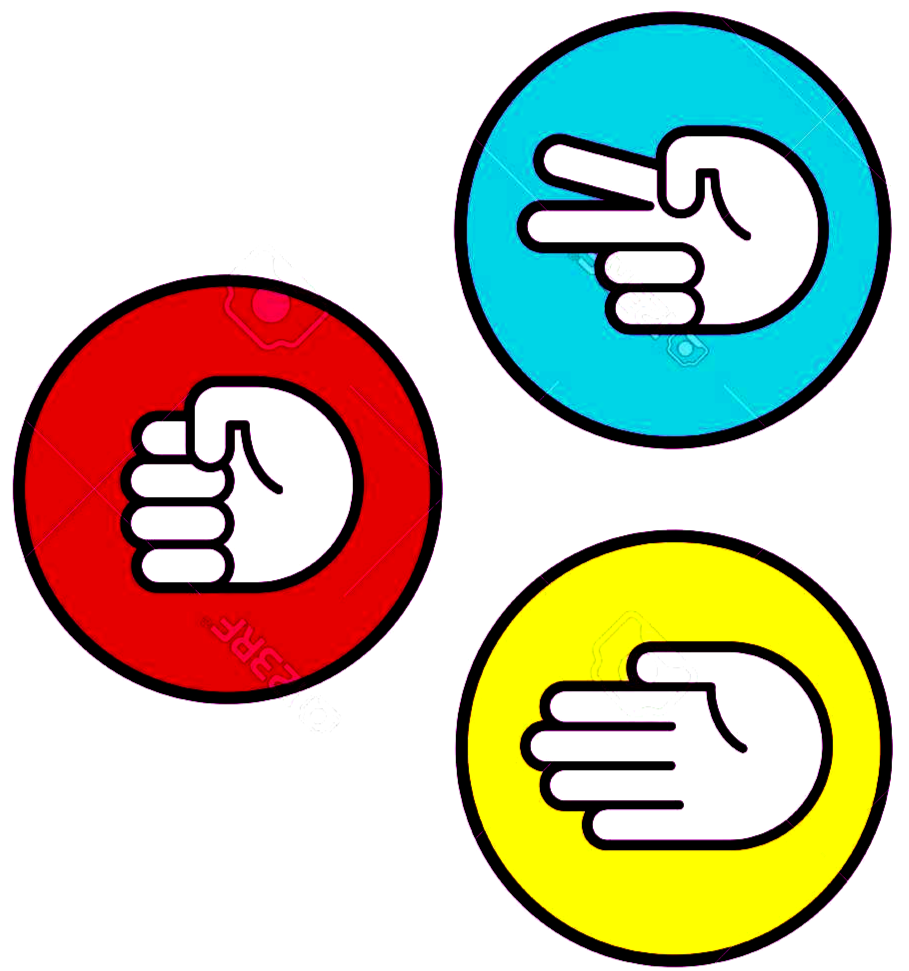

<h1 align="center">
  
   
</h1>

 

## About 👀
En este Juego puedes enfrentarte a la maquina para probar tu suerte y ver quien es el mejor en el juego de **Piedra, paple o tijera**.

## Instructions 📖
Selecciona tu mano, hay 3 opciones:

- Piedra (puño, circulo rojo) 
- Papel (mano, circulo amarillo) 
- Tijera (dos dedos, circulo azul)

Debajo del area de seleccion se mostrara el resultado del enfrentamiento.

En la parte derecha se muestra la puntiacion de cada jugador.

El primer jugador en obtener 3 victorias sera el ganador del duelo.

Puedes intertarlo cuantas veces quieras.

 [Aquí](https://cristhian-medina.github.io/rock_paper_scissors/) puedes enfrentarte a la maquina en duelo de **piedra, papel o tijera**.

> Este proyecto fue desarrollado en un lapso de 15 horas.
> 
> Utilizando las tecnologias CSS3, HTML5 y JavaScript.
>
>Tiene un enfoque a la programación funcional.
>
> Manupulación del DOM (Document Object Model).
>
> Se utilizo JSDoc como generador de documentacion. 
